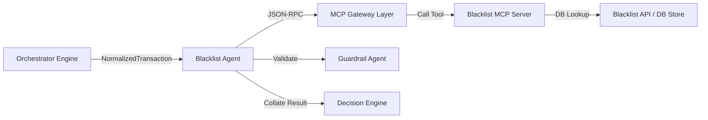

# Blacklist Agent

* **Tier**: Tier 1 (Fast-Path)
* **Default Latency Budget**: 10ms
* **Implementation Class**: `BlacklistAgent` ([blacklist_agent.py](file:///Users/ram/Desktop/multi-agent-fraud-detection/src/agents/tier1/blacklist_agent.py))

## 📝 Overview
Identifies known bad actors in real-time by cross-referencing transaction attributes against high-speed blacklists.

## 🗺️ Interaction Topology



## 🛠️ Mechanisms & MCP Tools
Queries the `blacklist_server` MCP service:
1. `check_card_blacklist(card_id)`: Checks if the payment instrument is flagged as stolen or compromised.
2. `check_device_blacklist(device_id)`: Checks if the device signature is associated with prior fraud events.
3. `check_merchant_blacklist(merchant_id)`: Checks if the merchant identity matches known fraudulent endpoints.

## 📥 Input Schema (JSON)
```json
{
  "card_id": "card_987654",
  "device_id": "dev_abc123",
  "merchant_id": "merch_12345"
}
```

## 📤 Output Schema (JSON)
```json
{
  "blacklisted": true,
  "card_blacklisted": false,
  "device_blacklisted": true,
  "merchant_blacklisted": false,
  "source": "device",
  "match_type": "exact",
  "evidence": [
    {
      "source": "blacklist_server",
      "claim": "Device signature matches high-risk card-generating syndicate",
      "confidence": 1.0
    }
  ]
}
```
