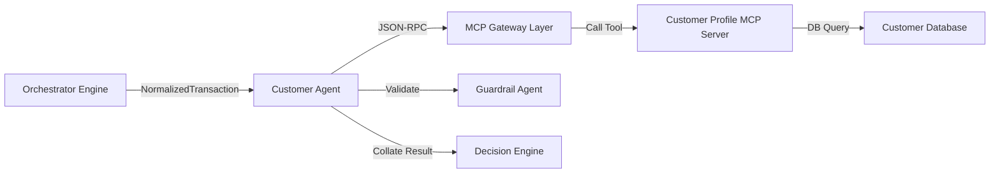

# Customer Agent

* **Tier**: Tier 1 (Fast-Path)
* **Default Latency Budget**: 20ms
* **Implementation Class**: `CustomerAgent` ([customer_agent.py](file:///Users/ram/Desktop/multi-agent-fraud-detection/src/agents/tier1/customer_agent.py))

## Overview
Analyzes customer profile data, spending patterns, account maturity, and calculates spending anomaly scores (z-scores) relative to the customer's historical average.

## Interaction Topology



## Mechanisms & MCP Tools
Queries the `customer_server` MCP service:
1. `get_customer_profile(customer_id)`: Fetches trust tier (`platinum`, `gold`, `silver`, `standard`, `new`), account age, total transactions, and historical fraud flags.
2. `get_spending_stats(customer_id)`: Fetches mean transaction amount and standard deviation.

### Spending Anomaly Calculation
The agent calculates the spending anomaly z-score as follows:

$$z = \frac{\text{Amount} - \text{Average Amount}}{\text{Standard Deviation}}$$

* A $z \ge 2.0$ generates an elevated risk flag.
* A $z \ge 3.0$ triggers immediate escalation.

## Input Schema (JSON)
```json
{
  "customer_id": "cust_456789",
  "amount_usd": 1250.00
}
```

## Output Schema (JSON)
```json
{
  "trust_tier": "premium",
  "avg_transaction_amount": 250.00,
  "spending_anomaly": 0.73,
  "account_age_days": 450,
  "total_transactions": 120,
  "fraud_history": 0,
  "evidence": [
    {
      "source": "customer_server",
      "claim": "Customer profile is premium, average transaction is $250.00. Spending z-score is low.",
      "confidence": 0.95
    }
  ]
}
```
