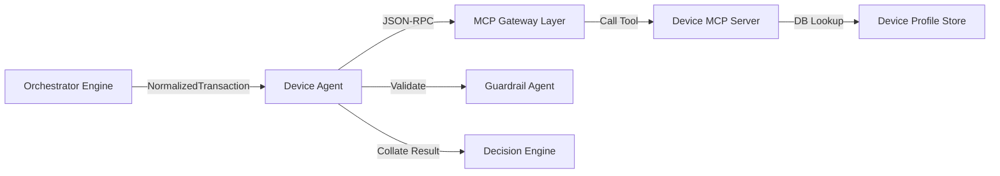

# Device Agent

* **Tier**: Tier 2 (Specialist)
* **Default Latency Budget**: 10ms
* **Implementation Class**: `DeviceAgent` ([device_agent.py](file:///Users/ram/Desktop/multi-agent-fraud-detection/src/agents/specialist/device_agent.py))

## 📝 Overview
Evaluates the physical device signature used to submit the transaction. Identifies device age, trust tier, and flags device sharing anomalies.

## 🗺️ Interaction Topology



## 🛠️ Mechanisms & MCP Tools
Queries the `device_server` MCP service:
1. `get_device_profile(device_id, customer_id)`: Determines if this is a new device or how long it has been associated with this account.
2. `check_device_sharing(device_id)`: Checks if this device has been used by multiple distinct customer IDs within a short window (a major signal of credential stuffing or compromise).

### Risk Score Calculation
* New device: `+0.4`
* Device shared with $N$ customers: `+0.3 * min(N/3, 1.0)`
* Device age under 7 days: `+0.2`
* Max Risk capped at `1.0`, baseline trusted device is `0.05`.

## 📥 Input Schema (JSON)
```json
{
  "device_id": "dev_abc123",
  "customer_id": "cust_456789"
}
```

## 📤 Output Schema (JSON)
```json
{
  "new_device": false,
  "device_age_days": 180,
  "shared_device": false,
  "device_risk": 0.05,
  "anomalies": [],
  "evidence": [
    {
      "source": "device_server",
      "claim": "Device is trusted and age is 180 days. No device sharing detected.",
      "confidence": 0.98
    }
  ]
}
```
