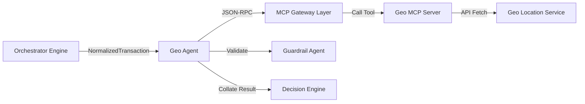

# Geo Agent

* **Tier**: Tier 2 (Specialist)
* **Default Latency Budget**: 15ms
* **Implementation Class**: `GeoAgent` ([geo_agent.py](file:///Users/ram/Desktop/multi-agent-fraud-detection/src/agents/specialist/geo_agent.py))

## 📝 Overview
Performs geographical verification, focusing on identifying "impossible travel" scenarios by analyzing elapsed time and distance between consecutive transactions.

## 🗺️ Interaction Topology



## 🛠️ Mechanisms & MCP Tools
Queries the `geo_server` MCP service:
1. `get_last_location(customer_id)`: Retrieves coordinates and timestamp of the customer's previous transaction.
2. `calculate_distance(lat1, lon1, lat2, lon2)`: Computes Haversine distance in kilometers.

### Impossible Travel Evaluation
The agent calculates the required speed to travel between the last location and the current transaction:

$$\text{Required Speed (km/h)} = \frac{\text{Distance (km)}}{\text{Time Elapsed (hours)}}$$

If the required speed exceeds **900 km/h** (commercial flight speeds), the agent flags **impossible travel** with a high confidence.

## 📥 Input Schema (JSON)
```json
{
  "customer_id": "cust_456789",
  "country": "US"
}
```

## 📤 Output Schema (JSON)
```json
{
  "distance_km": 0.0,
  "time_since_last_hours": 24.5,
  "required_speed_kmh": 0.0,
  "impossible_travel": false,
  "last_country": "US",
  "cross_border": false,
  "evidence": [
    {
      "source": "geo_server",
      "claim": "Distance is 0km, last transaction was 24.5 hours ago from same country (US). No impossible travel.",
      "confidence": 1.0
    }
  ]
}
```
