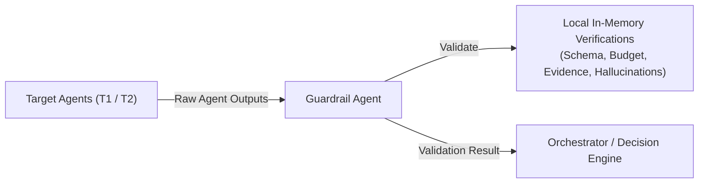

# Guardrail Agent

* **Tier**: Guardrail / Policy Compliance
* **Default Latency Budget**: 5ms
* **Implementation Class**: `GuardrailAgent` ([guardrail_agent.py](file:///Users/ram/Desktop/multi-agent-fraud-detection/src/agents/guardrail_agent.py))

## Overview
A strict validator that executes immediately after every agent completes execution. Validates outputs against data schemas, performance metrics, and compliance policies to enforce platform stability.

## Interaction Topology



## Mechanisms & Validations
The Guardrail Agent executes 5 major validations:
1. **Evidence Validation**: Verifies that any agent producing a significant threat flag (e.g. `blacklisted=True` or `burst=True`) has populated the evidence list with supporting assertions.
2. **Schema Validation**: Assures the response conforms to expected JSON/Pydantic structure and contains no empty or null payloads.
3. **Policy/Governance Auditing**: Runs rules via `validate_agent_output(...)` to verify the execution path (e.g. tracking tool hop counts).
4. **Budget Enforcement**: Checks that the actual agent processing duration does not exceed its allocated budget by more than a 20% safety tolerance.
5. **Hallucination Detection**: Inspects output variables for boundary violations:
   * Scores (`risk_score`, `device_risk`, `confidence`) must be within $[0.0, 1.0]$.
   * Quantities (distances, counts) must be non-negative.

## Input Schema (JSON)
```json
{
  "target_agent": "ml_risk_agent",
  "output_payload": {
    "risk_score": 0.35,
    "model_version": "rf-v1.2",
    "feature_importances": {
      "amount": 0.45,
      "country_risk": 0.25
    },
    "evidence": []
  },
  "duration_ms": 18.5,
  "max_hops": 3
}
```

## Output Schema (JSON)
```json
{
  "valid": true,
  "violations": [],
  "evidence_valid": true,
  "schema_valid": true,
  "policy_valid": true,
  "budget_valid": true,
  "hallucination_detected": false
}
```
