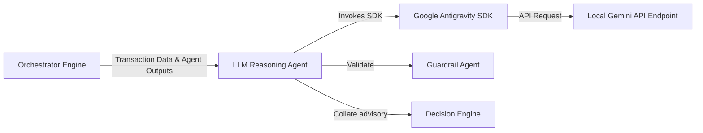

# LLM Reasoning Agent

* **Tier**: Tier 2 (Specialist)
* **Default Latency Budget**: 20ms
* **Implementation Class**: `LLMReasoningAgent` ([llm_reasoning.py](file:///Users/ram/Desktop/multi-agent-fraud-detection/src/agents/specialist/llm_reasoning.py))

## Overview
An advisory agent that leverages the **Google Antigravity (AGY) SDK** to perform a cognitive synthesis of evidence gathered from all preceding agents. 

## Interaction Topology



> [!IMPORTANT]
> **Advisory Only**: In compliance with security standards, the LLM reasoning agent is not authorized to make final block/approve decisions. It only issues recommendations (`APPROVE`, `DECLINE`, `ESCALATE`) along with structured reasoning.

## Mechanisms & Integration
Uses the Google Antigravity SDK:
1. Constructs a structured prompt detailing current transaction attributes and collected Tier 1 + Specialist outputs.
2. Invokes the local agent endpoint using `google.antigravity.Agent` and parses structured JSON output matching a strict `RiskAssessment` Pydantic schema.
3. Automatically falls back to a deterministic rule-based synthesis if the SDK is unavailable, disabled, or times out.

## Input Schema (JSON)
```json
{
  "transaction": {
    "transaction_id": "tx_999999",
    "amount_usd": 1250.00,
    "customer_id": "cust_456789",
    "country": "US"
  },
  "tier1_results": {
    "blacklist_agent": {
      "blacklisted": false
    },
    "customer_agent": {
      "spending_anomaly": 0.73
    },
    "ml_risk_agent": {
      "risk_score": 0.35
    }
  },
  "specialist_results": {
    "geo_agent": {
      "impossible_travel": false
    }
  }
}
```

## Output Schema (JSON)
```json
{
  "risk_level": "MEDIUM",
  "confidence": 0.75,
  "recommended_action": "APPROVE",
  "reasoning": "Transaction matches standard customer profile but shows elevated transaction amount. No other high-risk signals are present.",
  "evidence_summary": [
    "Amount is higher than average transaction size ($1250 vs $250 avg)"
  ],
  "risk_factors": [
    "high_value_transaction"
  ],
  "mitigating_factors": [
    "trusted_device",
    "same_country"
  ]
}
```
