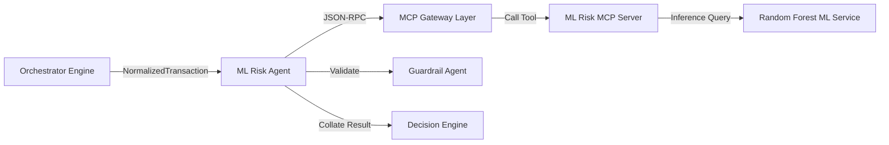

# ML Risk Agent

* **Tier**: Tier 1 (Fast-Path)
* **Default Latency Budget**: 25ms
* **Implementation Class**: `MLRiskAgent` ([ml_risk_agent.py](file:///Users/ram/Desktop/multi-agent-fraud-detection/src/agents/tier1/ml_risk_agent.py))

## 📝 Overview
Fetches statistical predictions from a serialized Random Forest classifier trained on historical transaction datasets.

## 🗺️ Interaction Topology



## 🛠️ Mechanisms & MCP Tools
Queries the `ml_server` MCP service:
* `predict_fraud_score(...)`: Supplies transaction features (amount, channel, merchant category, country, time, risk flags) and returns a probability score $[0.0, 1.0]$.

### Heuristic Fallback
If the model service is offline, the agent automatically executes a deterministic heuristic:
* Base score: `0.1`
* Amount > $5000: `+0.2`
* High risk country: `+0.25`
* High risk merchant: `+0.15`
* Online channel: `+0.05`
* Night hours (1-4 AM): `+0.1`

## 📥 Input Schema (JSON)
```json
{
  "amount_usd": 1250.00,
  "channel": "online",
  "merchant_category": "retail",
  "country": "US",
  "timestamp": 1781268800,
  "is_high_risk_country": false,
  "is_high_risk_merchant": false
}
```

## 📤 Output Schema (JSON)
```json
{
  "risk_score": 0.35,
  "model_version": "rf-v1.2",
  "feature_importances": {
    "amount_usd": 0.45,
    "channel_online": 0.15,
    "country_US": 0.10,
    "merchant_category_retail": 0.05
  },
  "evidence": [
    {
      "source": "ml_server",
      "claim": "Machine learning prediction indicates moderate risk. Primary factor: transaction size.",
      "confidence": 0.85
    }
  ]
}
```
