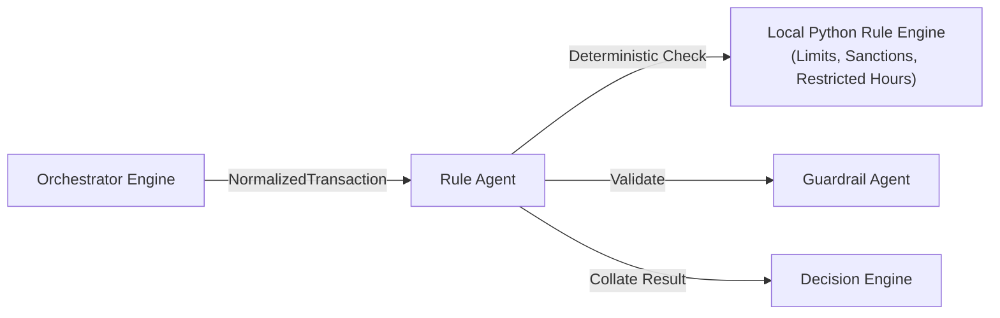

# Rule Agent

* **Tier**: Tier 1 (Fast-Path)
* **Default Latency Budget**: 5ms
* **Implementation Class**: `RuleAgent` ([rule_agent.py](file:///Users/ram/Desktop/multi-agent-fraud-detection/src/agents/tier1/rule_agent.py))

## Overview
Executes deterministic, compliance-driven business rules. This agent requires no external database or network lookups, making it highly reliable and extremely fast (<2ms).

## Interaction Topology



## Rules Evaluated
1. **SANCTIONED_COUNTRY** (Severity: `critical`): Checks if the transaction country code is in `{"KP", "IR", "SY", "CU", "SD"}`.
2. **HIGH_RISK_COUNTRY** (Severity: `medium`): Triggered if the transaction originates from a high-risk country (`is_high_risk_country` flag is true).
3. **HIGH_RISK_MERCHANT_CATEGORY** (Severity: `high`): Triggered if the merchant category is flagged as high-risk (`is_high_risk_merchant` flag is true).
4. **AMOUNT_EXCEEDS_LIMIT** (Severity: `high`): Checks if the transaction amount exceeds the static limit configured for the channel. The limits are:
   * `online`: $10,000.00
   * `pos`: $5,000.00
   * `atm`: $2,000.00
   * `mobile`: $10,000.00
   * `banking`: $50,000.00
   * Any other channel defaults to $10,000.00.
5. **SUSPICIOUS_TIME** (Severity: `low`): Triggered if the transaction hour falls within the restricted hours of `1, 2, 3, or 4` UTC (1:00 AM to 5:00 AM UTC).
6. **VERY_HIGH_AMOUNT** (Severity: `high`): Triggered if the transaction amount exceeds the absolute limit of $25,000.00, regardless of the channel.

## Input Schema (JSON)
```json
{
  "transaction_id": "tx-12345",
  "customer_id": "cust-987",
  "card_id": "card-456",
  "device_id": "dev-789",
  "amount_usd": 12500.00,
  "currency": "USD",
  "country": "KP",
  "merchant_id": "m-555",
  "merchant_category": "casino",
  "channel": "online",
  "timestamp": "2026-06-12T01:30:00Z",
  "is_high_risk_country": true,
  "is_high_risk_merchant": true
}
```

## Output Schema (JSON)
```json
{
  "violation": true,
  "rule_name": "SANCTIONED_COUNTRY",
  "rule_severity": "critical",
  "violations": [
    {
      "rule": "SANCTIONED_COUNTRY",
      "severity": "critical",
      "description": "Transaction from sanctioned country: KP"
    },
    {
      "rule": "HIGH_RISK_MERCHANT_CATEGORY",
      "severity": "high",
      "description": "High-risk merchant category: casino"
    }
  ],
  "evidence": [
    {
      "source": "rule_agent",
      "claim": "Country KP is on the sanctions list",
      "confidence": 1.0,
      "data": {
        "country": "KP",
        "list": "SANCTIONS"
      }
    }
  ],
  "_tool_calls_made": 0
}
```

