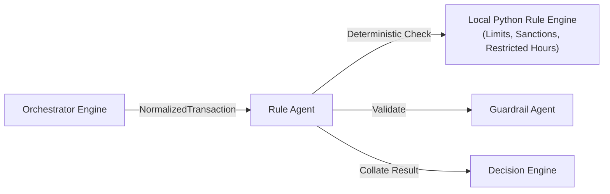

# Rule Agent

* **Tier**: Tier 1 (Fast-Path)
* **Default Latency Budget**: 5ms
* **Implementation Class**: `RuleAgent` ([rule_agent.py](file:///Users/ram/Desktop/multi-agent-fraud-detection/src/agents/tier1/rule_agent.py))

## 📝 Overview
Executes deterministic, compliance-driven business rules. This agent requires no external database or network lookups, making it highly reliable and extremely fast (<2ms).

## 🗺️ Interaction Topology



## ⚙️ Rules Evaluated
1. **Sanctioned Country Check**: Compares the transaction country against sanctioned territories (`KP`, `IR`, `SY`, `CU`, `SD`). A match raises a **critical** violation (unconditional decline).
2. **High-Risk Country Check**: Flags transactions from high-risk locations.
3. **High-Risk Merchant Category**: Flags risky merchant industries (e.g., casinos, crypto exchanges).
4. **Channel Limit Breaches**: Checks if transaction amount exceeds channel limits:
   * Online: $10,000
   * POS: $5,000
   * ATM: $2,000
   * Mobile: $10,000
   * Banking: $50,000
5. **Suspicious Hour**: Flags transactions occurring during restricted hours (1:00 AM - 5:00 AM UTC).
6. **Very High Amount**: Flags any transaction above $25,000.

## 📥 Input Schema (JSON)
```json
{
  "country": "KP",
  "amount_usd": 12500.00,
  "channel": "online",
  "merchant_category": "casino",
  "timestamp": 1781268800
}
```

## 📤 Output Schema (JSON)
```json
{
  "violation": true,
  "rule_name": "sanctioned_country",
  "rule_severity": "critical",
  "violations": [
    "sanctioned_country",
    "high_risk_merchant_category"
  ],
  "evidence": [
    {
      "source": "rule_agent",
      "claim": "Transaction country KP is sanctioned. Merchant category is high-risk casino.",
      "confidence": 1.0
    }
  ]
}
```
