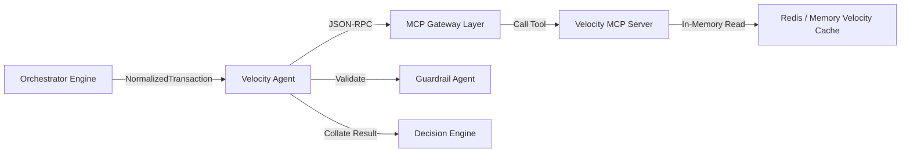

# Velocity Agent

* **Tier**: Tier 2 (Specialist)
* **Default Latency Budget**: 10ms
* **Implementation Class**: `VelocityAgent` ([velocity_agent.py](file:///Users/ram/Desktop/multi-agent-fraud-detection/src/agents/specialist/velocity_agent.py))

## Overview
Tracks high-frequency transaction bursts and spending velocity anomalies over rolling time windows (1-hour and 24-hour limits).

## Interaction Topology



## Mechanisms & MCP Tools
Queries the `velocity_server` MCP service:
1. `get_transaction_velocity(customer_id)`: Returns count of transactions in the last hour and last 24 hours, and distinct merchant count.
2. `get_amount_velocity(customer_id)`: Returns sum of transacted amount in the last hour and last 24 hours, and average hourly baseline.

### Burst Flags Evaluated
* **Hourly Count Burst**: $\ge 10$ transactions in 1 hour.
* **Daily Count Burst**: $\ge 30$ transactions in 24 hours.
* **Hourly Amount Burst**: $\ge \$5,000$ in 1 hour.
* **Acceleration Burst**: Hourly spend $> 3.0\times$ baseline average.
* **Merchant Diversity Burst**: $\ge 5$ distinct merchants transacted in under 1 hour.

## Input Schema (JSON)
```json
{
  "customer_id": "cust_456789"
}
```

## Output Schema (JSON)
```json
{
  "transactions_last_hour": 2,
  "transactions_last_day": 8,
  "amount_last_hour": 150.00,
  "amount_last_day": 850.00,
  "burst": false,
  "amount_acceleration": 1.2,
  "distinct_merchants_last_hour": 2,
  "evidence": [
    {
      "source": "velocity_server",
      "claim": "2 transactions in the last hour ($150.00 total) is within normal parameters.",
      "confidence": 1.0
    }
  ]
}
```
