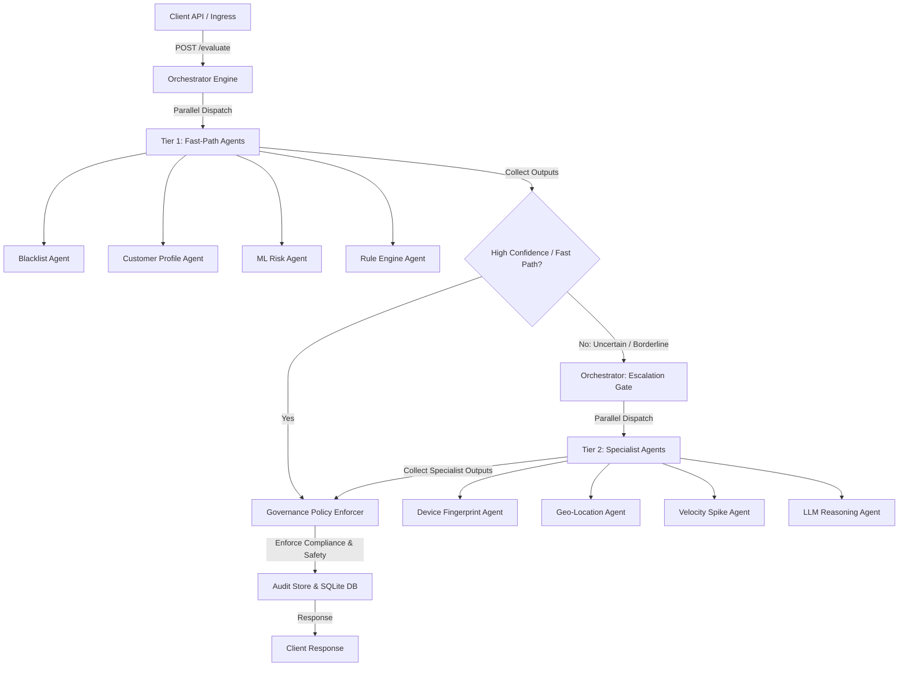

# Multi-Agent Fraud Detection & Escalation Platform

A production-grade, highly-optimized, multi-agent fraud detection and transaction escalation platform designed to satisfy a strict **100ms Service Level Agreement (SLA)**. Developed as part of the UBS recruitment evaluation process, this platform showcases advanced orchestration patterns, low-latency agent collaboration, and robust fail-safes.

---

## 🚀 Key Highlights & SLA Architecture
To process transactions within a strict **100ms SLA**, the platform implements a hybrid **Fast-Path / Deep-Escalation** architecture:
1. **Tier 1 (Fast-Path Agents)**: Evaluate rules, basic ML risks, customer profiles, and blacklists in parallel. If confidence is high (>0.85 or <0.15), the system immediately exits with an approval or rejection, completing under **10ms**.
2. **Tier 2 (Specialist/Escalation Agents)**: Triggered only for borderline, complex, or high-value transactions. Evaluates device fingerprinting, geo-location hops, velocity spikes, and (if budget/time permits) invokes a lightweight local LLM reasoning helper.
3. **Time-Budgets & Guardrails**: If evaluation exceeds **80ms**, the system automatically triggers a fallback policy enforcer to output a conservative decision rather than breaching the 100ms SLA.

---

## 🏛 Architecture Diagram & Agent Flow



---

## 📂 Project Structure

```
.
├── dashboard-react/       # Modern React dashboard visualizing transaction stats
├── dashboard/             # Static HTML/JS fallback dashboard
├── ml/                    # Machine learning pipeline, model trainers, and synthetic data
│   ├── model.pkl          # Trained serialized scikit-learn random forest model
│   ├── train_model.py     # Script to generate synthetic data and train the classifier
│   └── training_data.csv
├── src/
│   ├── agents/            # Multi-agent implementations (Base, Specialist, Tier 1)
│   ├── governance/        # Policy enforcers and hard risk compliance rules
│   ├── infrastructure/    # Audit store, caching, event bus, metrics
│   ├── ingress/           # FastAPI ingress servers, normalizers, and validators
│   ├── mcp/               # Model Context Protocol (MCP) gateways and specialist servers
│   ├── models/            # Pydantic schemas (Transactions, Decisions, Agent Outputs)
│   └── orchestrator/      # Dispatcher, budget manager, and decision gates
├── tests/                 # Unit and End-to-End integration tests
├── demo.py                # Demonstration script sending test payloads
└── pyproject.toml         # Hatch/PEP 621 Python package configuration
```

---

## 🛠 Prerequisites & Installation

The project uses `uv` for ultra-fast, reproducible dependency management, but standard `pip` works as well.

### 1. Install dependencies
```bash
# Using UV (Recommended)
uv sync

# Or using standard pip
pip install -e .
```

### 2. Prepare the ML Model (Optional)
If the model `ml/model.pkl` is missing or you want to retrain it, run:
```bash
python ml/train_model.py
```

---

## 🚦 How to Run the Platform

### 1. Start the Ingress Server
Run the FastAPI backend server on port `8000`:
```bash
# Option A: Run via standard uvicorn
uvicorn src.ingress.server:app --reload

# Option B: Run the provided shell helper
./run.sh
```

### 2. Run the Demo Client
In another terminal, send sample transactions to observe the classification engine and the SLA processing metrics:
```bash
python demo.py
```

### 3. Run the Test Suite
Ensure the code passes all constraints and integration specs:
```bash
pytest
```

---

## 💻 Web Dashboard

The frontend interface visualizes system load, latency histograms, classification decisions, and agent-level confidence tracking.

1. Navigate to the frontend directory:
   ```bash
   cd dashboard-react
   npm install
   npm run dev
   ```
2. Open [http://localhost:5173](http://localhost:5173) in your browser.

---

## ⚖ Governance and Policy Compliance
No matter how complex the agent reasoning, all decisions pass through the **Governance Policy Enforcer** (`src/governance/policy_enforcer.py`). This guarantees that:
* Hard blacklists are never bypassed (e.g. stolen card transactions are unconditionally rejected).
* High-value VIP transactions are handled with prioritized SLAs.
* Audit trail logs containing all agent responses, elapsed time, and confidence coefficients are archived in SQLite (`audit.db`) for regulatory reporting.
