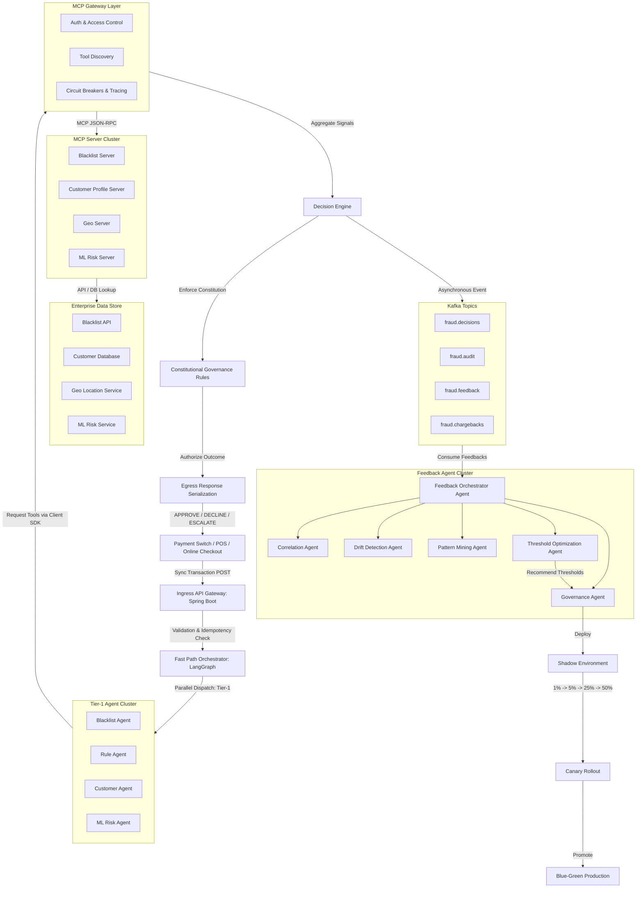
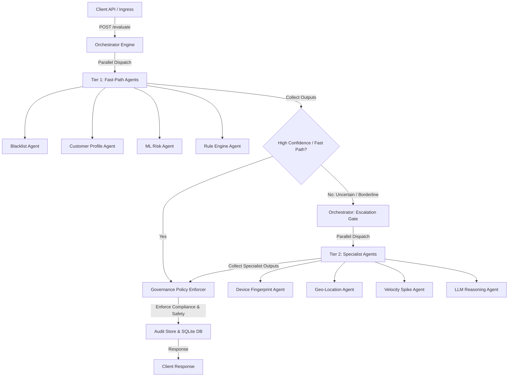

# Platform Solution Design: Real-Time Fraud Detection & Escalation
## Production-Grade Enterprise Multi-Agent System

This document specifies the target architecture, latency allocations, agent interfaces, and operational models for the **Enterprise Real-Time Fraud Detection and Escalation Platform**.

---

## System Architecture Topology

The platform coordinates decoupled, analytical agents through an MCP Gateway Layer, enforces strict SLA constraints via a centralized budget manager, and optimizes itself asynchronously through a Kafka-driven feedback pipeline.



### Orchestration & Agent Execution Flow

The orchestrator dynamically routes transactions through Tier-1 (Fast-Path) and Tier-2 (Specialist/Escalation) agents in sequence, optimized for confidence bounds:



---

## SLA Latency Budget Allocation (100ms Hard Limit)

To satisfy the payment switch's real-time authorization loop, latency is strictly partitioned:

| Component / Layer | Budget (ms) | Description |
| :--- | :--- | :--- |
| **Ingress Validation** | 10ms | Spring Boot gateway, payload normalization, signature validation, Redis idempotency. |
| **Orchestrator** | 5ms | LangGraph / custom orchestrator setup and asynchronous futures scheduling. |
| **Blacklist Agent** | 10ms | Card, device, and merchant lookup via MCP Gateway. |
| **Rule Agent** | 5ms | Deterministic checks (sanctions list, channel limits). |
| **Customer Agent** | 20ms | Trust profile retrieval and spending anomaly calculations. |
| **ML Risk Agent** | 25ms | Random Forest score prediction. |
| **Decision Engine** | 10ms | Weighted scoring synthesis and Constitutional Rule check. |
| **Egress** | 5ms | Response payload serialization and response delivery to switch. |
| **Reserve Buffer** | 10ms | Safety margin for scheduling overhead, GC pauses, and network jitter. |
| **Total** | **100ms** | **Strict SLA Ceiling.** |

---

## Model Context Protocol (MCP) Layer

Instead of calling APIs directly, all agents interact with the **MCP Gateway Layer**. This guarantees:
* **Abstraction**: Agents call standardized schemas; tool location and transport is transparent.
* **Access Control**: Strict authentication and authorization filters determine which agents access which servers.
* **Observability**: Centralized circuit breakers, metrics collection, and request tracing.
* **Budget Tracking**: Active propagation of transaction timeouts.

---

## Agent Input/Output Contracts

### 1. Blacklist Agent
* **Input Schema**:
  ```json
  {
    "card_id": "card_987654",
    "merchant_id": "merch_12345",
    "device_id": "dev_abc123"
  }
  ```
* **Output Schema**:
  ```json
  {
    "blacklisted": true,
    "type": "device",
    "evidence": [
      {
        "source": "blacklist_server",
        "claim": "Device signature matches high-risk card-generating syndicate",
        "confidence": 1.0
      }
    ]
  }
  ```

### 2. Customer Agent
* **Input Schema**:
  ```json
  {
    "customer_id": "cust_456789",
    "amount": 1250.00
  }
  ```
* **Output Schema**:
  ```json
  {
    "trust_tier": "premium",
    "avg_transaction": 250.00,
    "anomaly_score": 0.73
  }
  ```

### 3. Geo Agent
* **Input Schema**:
  ```json
  {
    "customer_id": "cust_456789",
    "country": "US"
  }
  ```
* **Output Schema**:
  ```json
  {
    "distance_km": 5600.0,
    "country_risk": "high",
    "impossible_travel": true
  }
  ```

---

## Constitutional Governance Rules

Decisions are validated against a strict set of business policies before egress:

```yaml
rules:
  no_policy_override: true       # Hard governance policies cannot be bypassed by agents.
  no_hallucinated_facts: true     # Out-of-bounds agent signals result in immediate validation failure.
  evidence_required: true         # Critical risk signals must supply verifiable database logs.
  max_agent_hops: 5               # Maximum recursion depth to prevent infinite orchestration loops.
  max_tool_calls: 3               # Maximum tool requests per agent to preserve latency bounds.
  budget_enforced: true           # Aggressive timeout aborts when remaining budget falls below reserve.
  deterministic_output: true      # Identical tool inputs must yield identical decisions.
  no_self_deployment: true        # Asynchronous agents cannot self-modify rules or thresholds.
  no_direct_policy_changes: true  # All recommendations must pass human review.
  escalate_on_uncertainty: true   # Ambiguous transactions default to ESCALATE or DECLINE.
  policy_always_wins: true        # Hard compliance limits unconditionally override agent advice.
```

---

## Asynchronous Feedback & Replay Loops

Decisions are streamed to a high-throughput **Kafka Event Bus** to close the feedback loop asynchronously:

```
[Decision Engine] ---> [Kafka Producer]
                            │
  ┌─────────────────────────┼─────────────────────────┐
  ▼                         ▼                         ▼
[fraud.decisions]       [fraud.audit]          [fraud.chargebacks]
```

### Feedback Agent Cluster
The **Feedback Orchestrator** monitors Kafka events and coordinates specialized analytical subagents:
* **Correlation Agent**: Correlates late-arriving chargebacks or disputes back to the original transaction ID, analyzing why the original decision was wrong.
* **Pattern Mining Agent**: Searches aggregated fraud records to flag emerging vectors (e.g., `same_device_many_cards`).
* **Threshold Optimization Agent**: Computes false positive/negative rates and recommends adjustment parameters (e.g. approving Standard Tier up to `0.12` instead of `0.10`). Recommends only; cannot deploy directly.

### Deployment Pipeline
Recommended threshold adjustments undergo a progressive staging sequence:
1. **Governance Agent Review**: Checks proposed config changes against safety checks.
2. **Shadow Mode**: proposal runs in parallel to production traffic (input-only evaluation).
3. **Canary Rollout**: Progressive traffic exposure ($1\% \rightarrow 5\% \rightarrow 25\% \rightarrow 50\%$).
4. **Blue-Green Promotion**: Replaces active production config once metrics are verified.
